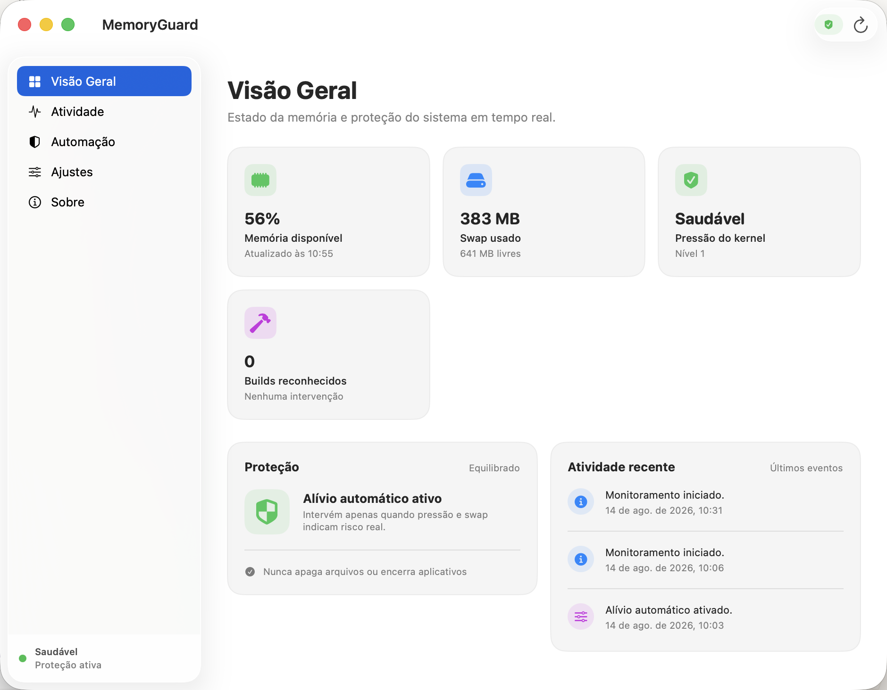
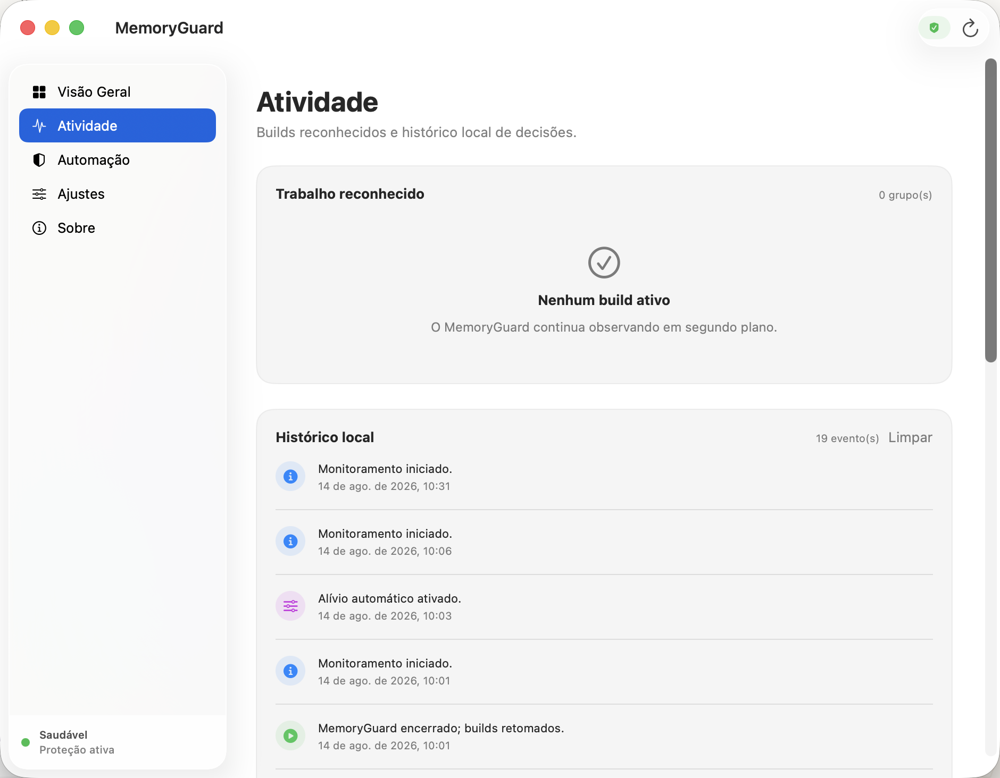
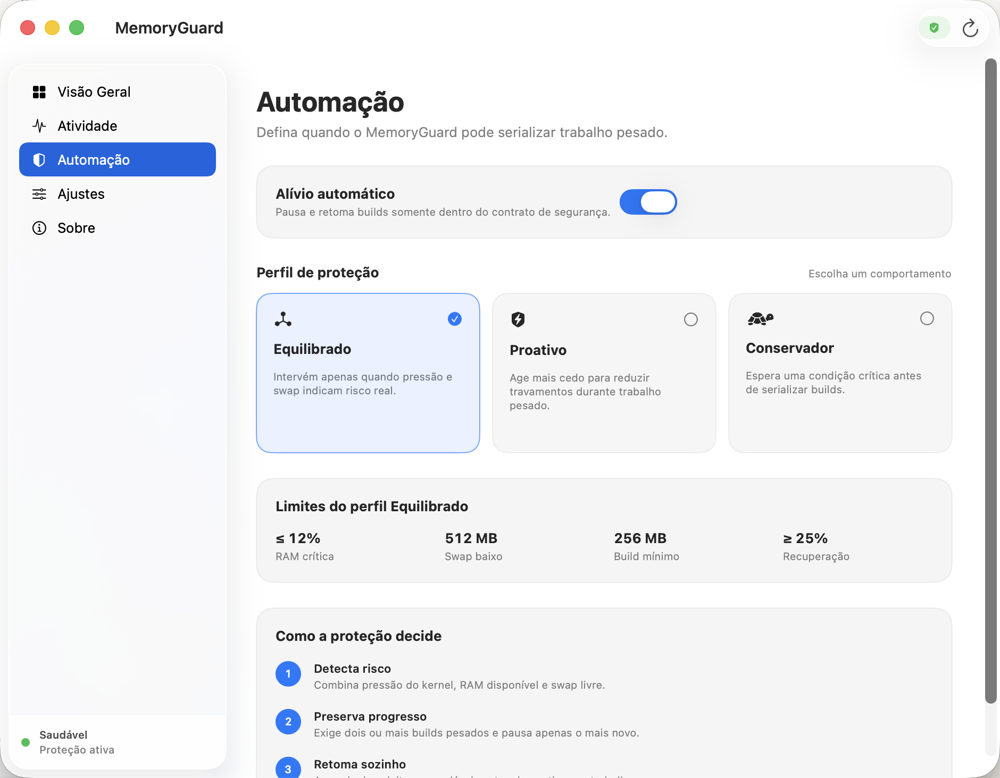
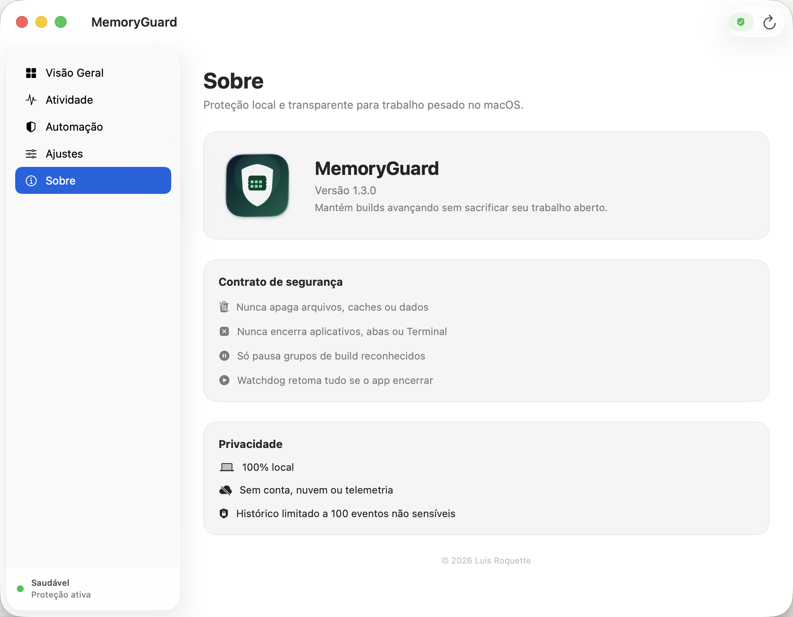

# MemoryGuard

**Memory pressure protection for developers who run more than one heavy build on a Mac.**

<p align="center">
  <a href="https://luisroquette.github.io/memoryguard/"></a>
  <a href="https://github.com/luisroquette/memoryguard/releases/latest"></a>
  <a href="LICENSE"></a>
  
</p>

You should not need to know when macOS is running a build, whether that build is
heavy, or when memory pressure is about to interrupt your work. MemoryGuard
watches those conditions locally and makes one conservative decision: when the
Mac is genuinely under pressure and at least two recognized builds are heavy,
temporarily pause the newest build so the older one can finish.

It never deletes files, clears caches, closes apps, kills processes, or pauses
your only heavy build.



## Who it is for

- Developers and AI-assisted builders running multiple projects at once.
- Macs compiling Next.js, Swift or TypeScript while tests and browser automation run.
- People who want fewer out-of-memory interruptions without a destructive “RAM cleaner.”
- Anyone who wants the decision to be automatic, visible and reversible.

It is not useful as a general performance booster, and it does not manage
unrecognized workloads. The prebuilt release currently supports Apple silicon.

## What it does

1. Samples available RAM, macOS kernel pressure and free swap every 5–30 seconds.
2. Recognizes Next.js, Swift, TypeScript, Vitest and Playwright build groups, then labels each as heavy or below the selected threshold.
3. Requires at least two eligible heavy groups before pausing anything.
4. Pauses only the newest eligible group, leaving the older one free to finish.
5. Resumes paused work after two fully healthy samples.

A watchdog also resumes the group if MemoryGuard exits unexpectedly.

| Activity and local decision history | Explicit automation profiles |
|---|---|
|  |  |

## What it never does

- Never deletes files, caches or project data.
- Never terminates an app, tab, terminal or process.
- Never pauses the only heavy build.
- Never uploads process data or telemetry.
- Never claims that all workloads are recognized.

## Install

Download the latest free build from [Releases](https://github.com/luisroquette/memoryguard/releases/latest).

```bash
# After unzipping and moving MemoryGuard.app to /Applications:
xattr -dr com.apple.quarantine /Applications/MemoryGuard.app
open /Applications/MemoryGuard.app
```

The free build is ad-hoc signed but not Apple-notarized yet, so Gatekeeper may
require the one-time quarantine command above. The prebuilt app requires macOS
14 or later on Apple silicon.

## How to use it

1. Open MemoryGuard and leave **Automatic relief** enabled.
2. Start with the **Balanced** profile; it is the recommended daily default.
3. Enable **Open at Login** if you want continuous protection.
4. Close the window if desired; MemoryGuard keeps running from the menu bar.
5. Open **Activity** whenever you want to inspect recognized work or resume all builds.

You do not need to decide whether a build is heavy. MemoryGuard measures the
resident memory of recognized process groups and compares it with the selected
profile. If the Overview says `0 recognized builds`, it is monitoring the Mac
but has not found a supported build workload.

## Protection profiles

| Profile | When it acts | Heavy group threshold | Recovery |
|---|---:|---:|---:|
| **Balanced** | ≤12% available RAM, critical kernel pressure, or warning pressure with ≤512 MB swap free | 256 MB | ≥25% RAM and ≥1 GB swap free |
| **Proactive** | Earlier, at ≤18% available RAM or ≤1 GB swap free under warning pressure | 192 MB | ≥30% RAM and ≥1.5 GB swap free |
| **Conservative** | Later, at ≤8% available RAM or critical kernel pressure | 384 MB | ≥20% RAM and ≥768 MB swap free |

Recovery requires two consecutive healthy samples. Swap thresholds apply when
macOS reports a swap capacity.

## Privacy and safety

MemoryGuard is local-first: no account, cloud service, analytics or telemetry.
Its audit history is stored in local user defaults and capped at 100 events.
Copied diagnostics contain metrics and automation state, not commands, paths or
process content.



## Build from source

```bash
git clone https://github.com/luisroquette/memoryguard.git
cd memoryguard
swift test
./Scripts/make-app.sh
open dist/MemoryGuard.app
```

The project uses Swift 6, SwiftUI and AppKit. It has no third-party runtime
dependencies.

## Known limitations

- Recognition is intentionally allow-listed: unknown compilers and custom wrappers are ignored.
- MemoryGuard only serializes work when there are at least two safe, eligible groups.
- The current prebuilt release is Apple-silicon-only and not notarized.
- The current app interface is in Brazilian Portuguese.

## License

[MIT](LICENSE) © 2026 Luis Roquette.

---

<p align="center">
  <strong>A free, local-first utility from <a href="https://github.com/luisroquette/RocketLabs">RocketLabs</a>.</strong>
</p>
